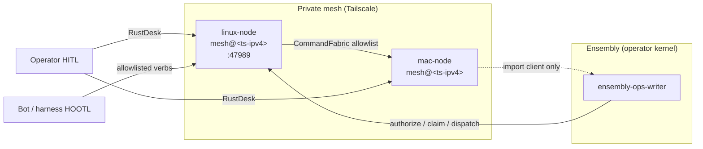

# Architecture overview

## Trust boundary

Untrusted bots and harnesses reach the mesh only through **CommandFabric**. If a verb is not on the allowlist, it is denied. That is the product.

```
Bots / harnesses / operators
        │
        ▼
┌───────────────────┐
│  HTTP / CLI / RPC │
└─────────┬─────────┘
          ▼
┌───────────────────┐
│  CommandFabric    │  ← allowlist (only these verbs dispatch)
└─────────┬─────────┘
          ▼
┌───────────────────┐     ┌─────────────────┐
│ ServiceRegistry   │     │ ConfigStore     │
│ HealthMonitor     │     │ SyncCoordinator │
│ TailscaleWatcher  │     │ (optional)      │
└───────────────────┘     └─────────────────┘
          │
          ▼
   Distributed Erlang nodes on a private network
```

## Core pieces

| Module | Job |
|--------|-----|
| **CommandFabric** | Allowlisted commands only; `shell` never ships on the allowlist |
| **ServiceRegistry** | Local map of services the node knows about |
| **ConfigStore** | Shared config with merge semantics across nodes |
| **HealthMonitor** | Cluster health / partition awareness |
| **SyncCoordinator** | Optional Syncthing conflict helpers |
| **TailscaleWatcher** | Peer events when Tailscale CLI is present |
| **Web server** | Dashboard + JSON command API on `:47989` |

## What this is not

- Not a general remote shell
- Not a multi-tenant cloud control plane
- Not a requirement to run Sunshine or share the mesh checkout over Syncthing

## With ensembly (cross-participant)

This mesh **dispatches** allowlisted machine acts. It does not own life-state ledgers.

An operator kernel ([ensembly](https://github.com/thecuriousts/ensembly)) can **authorize and claim** work on one node and still get an allowlisted act **done on another participant** through CommandFabric:

**bot/harness proposes → ensembly authorizes/claims → mesh dispatches → peer node executes.**

Ensembly owns whether the act is owed. Mesh owns that only allowlisted verbs run across the Tailscale cluster. Syncthing, Sunshine, and VNC are optional host tools — they do not decide what bots may run.

Operator-specific pairing diagrams stay out of this public dump.

## Fleet topology (overview)

Dogfood layout: a **two-node** mesh over Tailscale — **linux-node** (`MESH_HOST_A`, primary ops peer) and **mac-node** (`MESH_HOST_B`, headless Mac peer). Live Tailscale IPv4 addresses, Syncthing device IDs, and host-specific overrides belong in a local `.env.lab` (from `.env.lab.example`); they are never committed.

| Role | Peer | Notes |
|------|------|-------|
| Mesh + CommandFabric writer | **linux-node** (`MESH_HOST_A`) | OTP node `mesh@<tailscale-ipv4>`; dashboard / JSON API |
| Mesh import client | **mac-node** (`MESH_HOST_B`) | Joins the cluster; ensembly import target — **no dual-write** |
| Ensembly ops writer | **ensembly-ops-writer** | Authorizes and claims work; dispatches allowlisted acts via mesh |
| HITL desktop | RustDesk | Native VNC parked; operator reaches hosts out-of-band |
| HOOTL (hands-off-the-loop) | CommandFabric | Bots/harnesses mutate only through the allowlist |

**Ports (typical):**

| Port | Use |
|------|-----|
| `:47989` | Mesh web dashboard + `/command` API (`MESH_WEB_PORT` override when colliding) |
| `:4369` | Erlang Port Mapper Daemon (distribution) |
| `:9100–9200` | Reserved band for adjacent host tools (e.g. remote desktop helpers) |



This public mirror keeps **role labels and port conventions** only. Day-by-day bring-up logs, blocker narratives, LaunchAgent tables, and verification scripts live in the operator Origin repo under `docs/fleet/*`.
