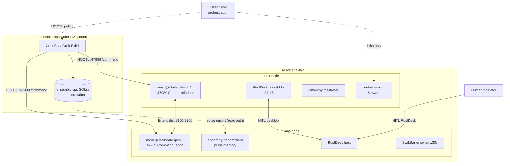
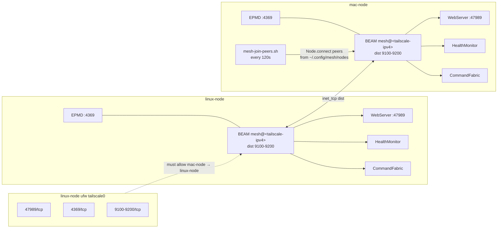
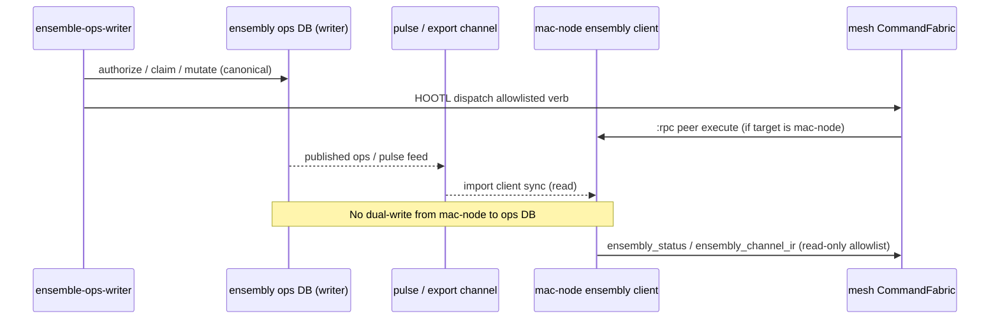
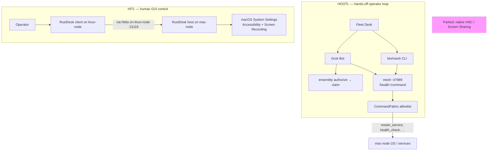
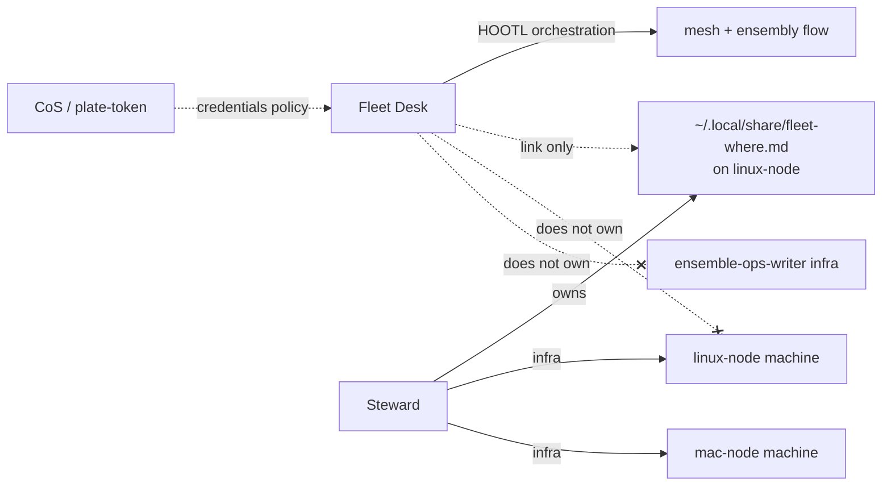

# Fleet architecture: mesh, ensembly, and HITL (2026-09)

Durable reference for the **linux-node + mac-node** fleet slice and how it connects to the Grok Bot computer. Operational day log: [2026-09-12-mini-linux-node-bringup.md](2026-09-12-mini-linux-node-bringup.md).

**Trust boundary unchanged:** bots reach homelab only through **CommandFabric** allowlist on `:47989`. See [../architecture.md](../architecture.md).

**Addresses stay local:** Tailscale IPs, `.local` hostnames, and device IDs belong in `.env.lab` (from [`.env.lab.example`](../../.env.lab.example)) and `~/.config/mesh/nodes` — not in committed markdown.

---

## Host summary

| Label | Erlang node | Primary roles |
|-------|-------------|---------------|
| **linux-node** | `mesh@<tailscale-ipv4>` | Mesh node, RustDesk rendezvous/relay, Omarchy mesh-bar, Steward WHERE card |
| **mac-node** | `mesh@<tailscale-ipv4>` | Mesh node, ensembly **import client**, RustDesk host, SwiftBar ensembly menu |
| **ensemble-ops-writer** | — | Ensembly **ops writer**, Grok Build worktrees, HOOTL dispatch to mesh |

Resolve `<tailscale-ipv4>` per host from `MESH_TS_A` / `MESH_TS_B` in `.env.lab`.  
Cookie path (all mesh nodes): `~/.config/mesh/cookie`  
Peer list (join helper): `~/.config/mesh/nodes`

---

## 1. Fleet topology

Tailscale is the only routable fabric between cloud Bot, Linux laptop, and headless Mac.



**Legend**

- **Solid lines:** runtime data / control paths in production
- **Dotted lines:** policy, import, or human-only paths
- **Parked:** native macOS Screen Sharing / VNC (not shown)

---

## 2. Mesh OTP cluster

Two-node distributed Erlang over Tailscale. Both nodes use **longnames** = `mesh@<tailscale-ipv4>`.



### Port matrix

| Port | Protocol | Purpose |
|------|----------|---------|
| 47989 | TCP | HTTP health, dashboard, `/command` |
| 4369 | TCP | EPMD (Erlang Port Mapper Daemon) |
| 9100–9200 | TCP | Erlang distribution (pinned via `ELIXIR_ERL_OPTIONS`) |
| 21116 | TCP | RustDesk rendezvous (hbbs; typical default) |

### Peer discovery model

`Mesh.HealthMonitor` tracks peers from `[node() | Node.list()]`. It does **not** read `~/.config/mesh/nodes` itself. The mac-node LaunchAgent `mesh-join-peers.sh` closes the gap by calling `Node.connect/1` on boot and every 120 seconds.

### Quorum

With two nodes, healthy cluster means:

- `quorum.up == 2`, `quorum.total == 2`, `has_quorum == true`
- `split_brain == false`
- Peer keys in `/health` JSON are longnames (`mesh@<tailscale-ipv4>`), not hostnames or `.local` names

### Tailscale note

linux-node **ShieldsUp=false** is required in addition to ufw. ShieldsUp blocks Tailscale inbound even when local firewall allows traffic.

---

## 3. Ensembly: write path vs mac-node import

Single writer for ops SQLite; mac-node is import-only.



| Concern | Owner |
|---------|-------|
| done / pending / denied ledger | ensembly on ensemble-ops-writer |
| Allowlisted machine acts on homelab | mesh CommandFabric |
| mac-node local aux / pulse-memory | mac-node import client |
| **Refused** | Dual-writing ops SQLite from mesh nodes |

Cross-participant pattern (unchanged from product map):

```
bot proposes → ensembly authorizes/claims → CommandFabric dispatches → peer executes
```

See [../../arch-design/ensembly-bridge.md](../../arch-design/ensembly-bridge.md).

---

## 4. HOOTL vs HITL control planes

Two orthogonal surfaces: automation (HOOTL) and human GUI (HITL).



| Mode | Actor | When |
|------|-------|------|
| HOOTL | Grok Bot + Fleet Desk | Routine fleet ops, allowlisted mesh verbs, ensembly lifecycle |
| HITL | Human operator via RustDesk | Password prompts, TCC dialogs, menu bar, SwiftBar/Control Center |

**Supporting infra:** `caffeinate -dims` LaunchAgent keeps mac-node awake during remote sessions.

**RustDesk gotcha:** `collapse_toolbar=Y` can hide the view-only toggle even when `view_only=false` in config — verify toolbar state before debugging input issues.

---

## 5. Fleet roles



---

## 6. Component map (mesh OTP)

Same modules as generic mesh; fleet adds join helpers and pinned dist ports.

| Module | Fleet-relevant behavior |
|--------|-------------------------|
| **CommandFabric** | Allowlisted RPC; Grok Bot primary remote control |
| **HealthMonitor** | Quorum 2/2; peers from `Node.list()` |
| **WebServer** | `:47989` on each node |
| **ConfigStore** | In-memory merge across connected nodes |
| **TailscaleWatcher** | Peer up/down events when CLI present |
| **ServiceRegistry** | Local service map per node |

---

## 7. Security posture (summary)

| Layer | linux-node | mac-node |
|-------|--------|----------|
| Mesh auth | Shared cookie file; bearer token for CLI | Same cookie; LaunchAgent env |
| Network | ufw on `tailscale0`; ShieldsUp off | Hardening script; Tailscale only |
| Remote GUI | RustDesk client | RustDesk host + macOS TCC |
| Remote shell | Not primary control plane | Remote Login off (policy) |
| Secrets in git | **Never** — use local paths only | **Never** |

---

## Related docs

- [2026-09-12-mini-linux-node-bringup.md](2026-09-12-mini-linux-node-bringup.md) — day log and verification commands
- [../architecture.md](../architecture.md) — CommandFabric trust boundary
- [../operator-surface.md](../operator-surface.md) — HTTP/CLI operator surface
- [../getting-started.md](../getting-started.md) — build and start (generic)
- [../../arch-design/ensembly-bridge.md](../../arch-design/ensembly-bridge.md) — product ownership boundaries
- [../../.env.lab.example](../../.env.lab.example) — local labels and IP placeholders
